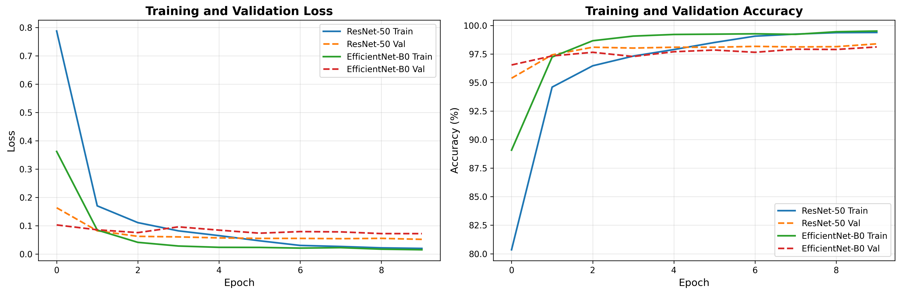
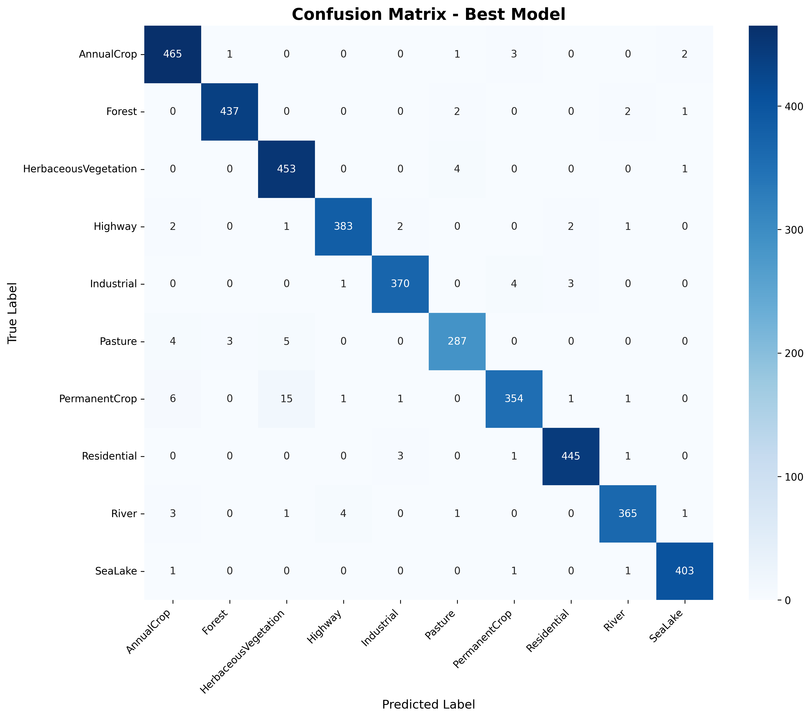
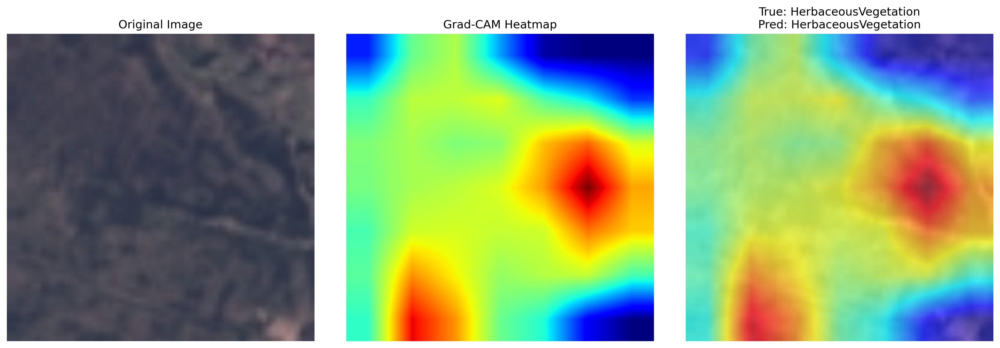
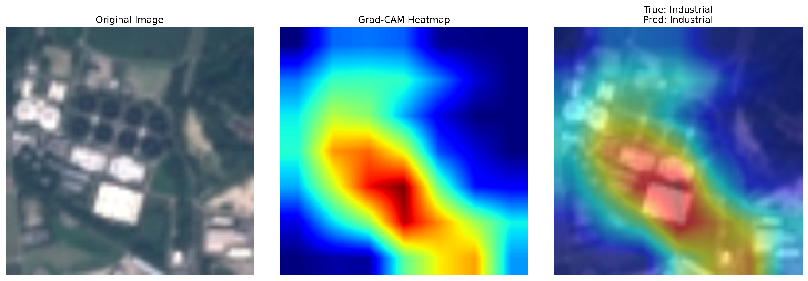

# 🛰️ Satellite Image Classification with Deep Learning

[](https://www.python.org/)
[](https://pytorch.org/)
[](LICENSE)
[](https://colab.research.google.com/)

A comprehensive deep learning project for classifying satellite imagery into land use categories using transfer learning and state-of-the-art computer vision models.

## 📋 Table of Contents

- [Overview](#overview)
- [Results](#results)
- [Dataset](#dataset)
- [Model Architecture](#model-architecture)
- [Installation](#installation)
- [Usage](#usage)
- [Project Structure](#project-structure)
- [Visualizations](#visualizations)
- [Future Improvements](#future-improvements)
- [License](#license)
- [Acknowledgments](#acknowledgments)

## 🎯 Overview

This project demonstrates multi-class image classification on the **EuroSAT dataset**, which contains 27,000 Sentinel-2 satellite images across 10 land use and land cover classes. The project showcases:

- **Transfer Learning** with multiple architectures (ResNet-50, EfficientNet-B0)
- **Advanced Data Augmentation** techniques for satellite imagery
- **Model Interpretability** using Grad-CAM visualizations
- **Comprehensive Evaluation** with detailed metrics and analysis
- **Interactive Demo** with Gradio interface

### Key Features

✅ Automatic dataset download and preprocessing
✅ Multiple model architecture comparison
✅ Advanced data augmentation pipeline
✅ Grad-CAM visualizations for model interpretability
✅ High-resolution result exports
✅ Interactive web demo
✅ Comprehensive documentation

## 🏆 Results

### Model Performance

| Model | Parameters | Val Accuracy | Test Accuracy | F1-Score |
|-------|-----------|--------------|---------------|----------|
| **ResNet-50** | 25.6M | **98.40%** | - | - |
| **EfficientNet-B0** | 5.3M | 98.12% | **97.83%** | **0.978** |

### Per-Class Performance

| Class | Precision | Recall | F1-Score | Support |
|-------|-----------|--------|----------|---------|
| Annual Crop | 0.97 | 0.99 | 0.98 | 472 |
| Forest | 0.99 | 0.99 | 0.99 | 442 |
| Herbaceous Vegetation | 0.95 | 0.99 | 0.97 | 458 |
| Highway | 0.98 | 0.98 | 0.98 | 391 |
| Industrial | 0.98 | 0.98 | 0.98 | 378 |
| Pasture | 0.97 | 0.96 | 0.97 | 299 |
| Permanent Crop | 0.98 | 0.93 | 0.95 | 379 |
| Residential | 0.99 | 0.99 | 0.99 | 450 |
| River | 0.98 | 0.97 | 0.98 | 375 |
| Sea/Lake | 0.99 | 0.99 | 0.99 | 406 |
| **Overall** | **0.98** | **0.98** | **0.98** | **4050** |

### Training Configuration

- **Optimizer:** Adam
- **Learning Rate:** 0.0001
- **Scheduler:** ReduceLROnPlateau
- **Epochs:** 10
- **Batch Size:** 32
- **Training Time:** ~10-15 minutes per model on Colab T4 GPU

## 📊 Dataset

**EuroSAT: Land Use and Land Cover Classification with Sentinel-2**

- **Total Images:** 27,000 (64×64 pixels, RGB)
- **Number of Classes:** 10
- **Source:** [EuroSAT Dataset](https://arxiv.org/abs/1709.00029)
- **Split:** Train (70%) / Validation (15%) / Test (15%)

### Classes

1. **Annual Crop** - 3,000 images
2. **Forest** - 3,000 images
3. **Herbaceous Vegetation** - 3,000 images
4. **Highway** - 2,500 images
5. **Industrial** - 2,500 images
6. **Pasture** - 2,000 images
7. **Permanent Crop** - 2,500 images
8. **Residential** - 3,000 images
9. **River** - 2,500 images
10. **Sea/Lake** - 3,000 images

### Class Distribution


### Sample Images


## 🏗️ Model Architecture

### Transfer Learning Approach

Both models use **transfer learning** from ImageNet pre-trained weights:

#### ResNet-50
- **Architecture:** Residual Network with 50 layers
- **Parameters:** 25.6M
- **Key Feature:** Skip connections for better gradient flow
- **Performance:** 98.40% validation accuracy

#### EfficientNet-B0
- **Architecture:** Efficient compound scaling
- **Parameters:** 5.3M (5× fewer than ResNet-50)
- **Key Feature:** Balanced depth, width, and resolution scaling
- **Performance:** 98.12% validation accuracy, 97.83% test accuracy

### Data Augmentation Pipeline

```python
- Resize to 224×224
- Random Horizontal Flip (p=0.5)
- Random Vertical Flip (p=0.5)
- Random Rotation (±30°)
- Color Jitter (brightness, contrast, saturation, hue)
- Random Affine Transform
- Normalization (ImageNet stats)
```

## 🚀 Installation

### Option 1: Google Colab (Recommended)

1. Open the notebook in [Google Colab](https://colab.research.google.com/)
2. Upload `satellite_image_classification.ipynb`
3. Enable GPU: Runtime → Change runtime type → GPU (T4 or better)
4. Run all cells

### Option 2: Local Setup

```bash
# Clone the repository
git clone https://github.com/yourusername/satellite-image-classification.git
cd satellite-image-classification

# Create virtual environment
python -m venv venv
source venv/bin/activate  # On Windows: venv\Scripts\activate

# Install dependencies
pip install torch torchvision
pip install timm grad-cam gradio
pip install scikit-learn matplotlib seaborn tqdm

# Open notebook
jupyter notebook satellite_image_classification.ipynb
```

### Requirements

- Python 3.8+
- PyTorch 2.0+
- CUDA-capable GPU (recommended)
- 12GB+ RAM
- ~500MB storage for dataset and models

## 💻 Usage

### Training Models

```python
# Train ResNet-50
resnet_model = create_model('resnet50', num_classes=10, pretrained=True)
resnet_history, resnet_best_acc = train_model(
    resnet_model,
    train_loader,
    val_loader,
    num_epochs=10,
    device=device
)

# Train EfficientNet-B0
efficientnet_model = create_model('efficientnet_b0', num_classes=10, pretrained=True)
efficientnet_history, efficientnet_best_acc = train_model(
    efficientnet_model,
    train_loader,
    val_loader,
    num_epochs=10,
    device=device
)
```

### Making Predictions

```python
import torch
import timm
from torchvision import transforms
from PIL import Image

# Load trained model
model = timm.create_model('efficientnet_b0', pretrained=False, num_classes=10)
model.load_state_dict(torch.load('best_model.pth', map_location='cpu'))
model.eval()

# Prepare image
transform = transforms.Compose([
    transforms.Resize((224, 224)),
    transforms.ToTensor(),
    transforms.Normalize([0.485, 0.456, 0.406], [0.229, 0.224, 0.225])
])

# Predict
image = Image.open('satellite_image.jpg')
input_tensor = transform(image).unsqueeze(0)
output = model(input_tensor)
prediction = output.argmax(1).item()

classes = ['AnnualCrop', 'Forest', 'HerbaceousVegetation', 'Highway',
           'Industrial', 'Pasture', 'PermanentCrop', 'Residential',
           'River', 'SeaLake']
print(f"Predicted class: {classes[prediction]}")
```

### Interactive Demo

```python
import gradio as gr

# Launch Gradio interface
demo.launch(share=True)
```

## 📁 Project Structure

```
satellite-image-classification/
├── satellite_image_classification.ipynb  # Main notebook with all code
├── README.md                             # This file
├── LICENSE                               # MIT License
├── .gitignore                           # Git ignore file
├── assets/
│   └── images/                          # Visualizations for README
│       ├── class_distribution.png
│       ├── sample_images.png
│       ├── training_history.png
│       ├── confusion_matrix.png
│       └── gradcam_sample_*.png
├── results/
│   ├── model_results.json               # Detailed metrics
│   └── project_summary.txt              # Complete text report
└── satellite_classification_results/    # Full results package
    ├── models/
    │   └── best_model.pth              # Trained model weights
    └── visualizations/                  # All generated plots
```

## 📈 Visualizations

### Training History



*Training and validation loss/accuracy curves showing convergence for both ResNet-50 and EfficientNet-B0.*

### Confusion Matrix



*Confusion matrix showing the model achieves high accuracy across all 10 classes with minimal misclassification.*

### Grad-CAM Interpretability

<p align="center">
  
</p>

<p align="center">
  
</p>

*Grad-CAM visualizations showing what the model focuses on when making predictions. The heatmaps highlight relevant features like roads for highways, buildings for residential areas, and water bodies for rivers/lakes.*

## 🎓 Key Learnings

### Technical Insights

1. **Transfer Learning Effectiveness**: Pre-trained ImageNet weights provide excellent starting point, achieving 98%+ accuracy with minimal training
2. **Model Efficiency**: EfficientNet-B0 achieves comparable performance to ResNet-50 with 5× fewer parameters
3. **Data Augmentation Impact**: Aggressive augmentation prevents overfitting and improves generalization
4. **Class Balance**: Balanced dataset (2000-3000 images per class) enables consistent performance across all categories

### Model Interpretability

- Grad-CAM visualizations confirm model learns relevant features:
  - **Highways**: Focuses on road structures
  - **Residential**: Highlights building patterns
  - **Forest**: Identifies vegetation texture
  - **Water Bodies**: Recognizes water surfaces

## 🔮 Future Improvements

### Model Enhancements
- [ ] Test larger models (EfficientNet-B3/B4, Vision Transformer)
- [ ] Implement ensemble methods combining multiple architectures
- [ ] Experiment with advanced augmentation (MixUp, CutMix, AutoAugment)
- [ ] Fine-tune more layers with longer training schedules

### Technical Additions
- [ ] Add cross-validation for robust performance estimation
- [ ] Implement test-time augmentation (TTA)
- [ ] Use weighted loss for handling class imbalance
- [ ] Add experiment tracking with Weights & Biases or MLflow

### Deployment
- [ ] Create REST API with FastAPI
- [ ] Deploy on cloud platforms (AWS, GCP, Azure)
- [ ] Build mobile app for on-device inference
- [ ] Implement batch processing pipeline for large-scale analysis

### Applications
- [ ] Real-time satellite feed processing
- [ ] Change detection over time series
- [ ] Integration with GIS systems
- [ ] Multi-temporal analysis

## 🌍 Real-World Applications

This project demonstrates techniques applicable to:

- **Urban Planning**: Monitor city development and expansion
- **Agriculture**: Crop type identification and health monitoring
- **Environmental Conservation**: Track deforestation and land use changes
- **Disaster Response**: Assess damage from natural disasters
- **Infrastructure Planning**: Plan roads, utilities, and public services
- **Climate Research**: Monitor environmental changes over time

## 📝 License

This project is licensed under the MIT License - see the [LICENSE](LICENSE) file for details.

## 🙏 Acknowledgments

- **EuroSAT Dataset**: [Helber et al., 2019](https://arxiv.org/abs/1709.00029)
- **PyTorch Team**: For the excellent deep learning framework
- **timm Library**: Ross Wightman for PyTorch Image Models
- **Grad-CAM**: [Selvaraju et al., 2017](https://arxiv.org/abs/1610.02391)
- **Google Colab**: For providing free GPU resources

## 📧 Contact

For questions, suggestions, or collaboration opportunities, feel free to reach out!

---

**⭐ If you found this project helpful, please consider giving it a star!**

---

*Built with ❤️ using PyTorch and Google Colab*
